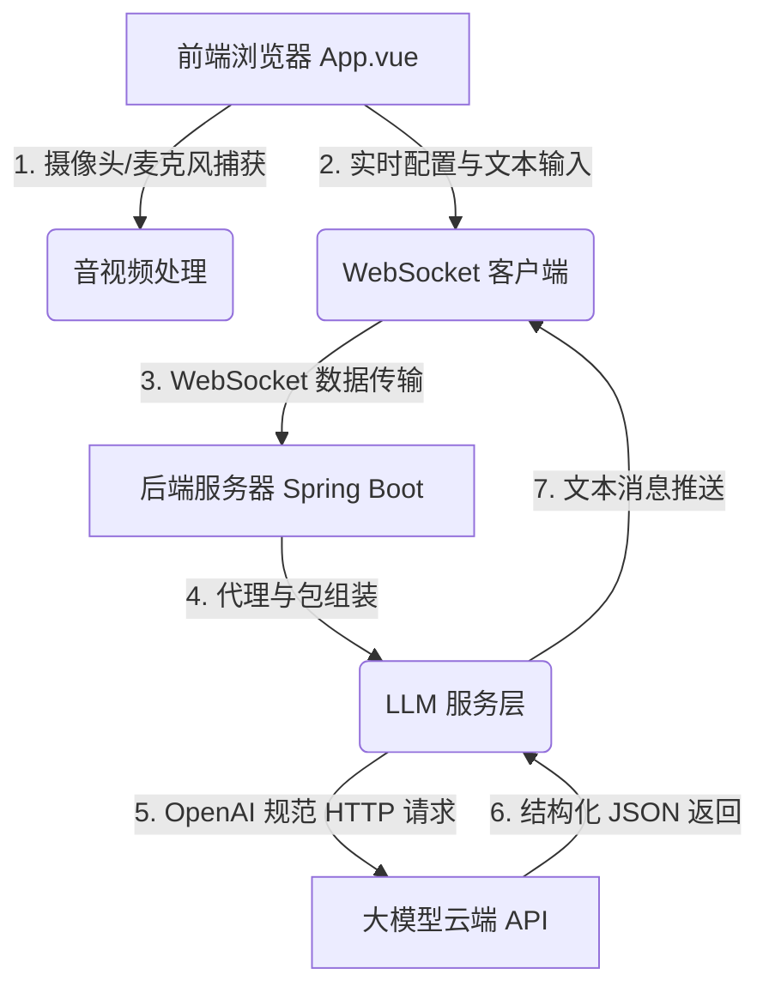

# 🌌 AURA VISION - 智能视觉对话助手 (MVP)

> **2026 七牛云 AI 大模型应用开发挑战赛作品**
> 
> AURA VISION 是一款具有未来感科技风的实时音视频对话助手。它能够通过摄像头捕获你的动作与身处环境的画面，配合 Web Speech 语音输入实现流畅的人机协同对话。

---

## 🎬 演示与修复视频 (Demo Videos)

- 🎥 **[点击观看项目演示 Demo 测试视频 (Bilibili)](https://www.bilibili.com/video/BV1K8JK61E1r/)**
- 🛠️ **[点击观看关于第一条demo视频中呈现的 Bug 修复视频 (Bilibili)](https://www.bilibili.com/video/BV17DJK6wELm/)**

📖 **[点击查看详细设计文档 (DESIGN_DOCUMENT.md)](./DESIGN_DOCUMENT.md)** *(包含用户故事实现对照与端云协同成本控制技巧分析)*

---

## ✨ 核心亮点与功能

- 👁️ **实时视觉交互**：自动捕获摄像头视频帧，利用多模态视觉模型（如 `qwen-vl-max`）实时分析用户的动作、面部表情或身处的物理场景。
- 🎙️ **智能语音感知**：基于 Web Speech API 进行高准确度中文语音识别，用户无需打字，直接通过语音与 AI 助手无缝对话。在 AI 思考或输出时，系统会**自动关闭麦克风**以防止背景杂音对输入造成干扰。
- 🎙️ **单次录音一键发送**：提供独立的语音输入（🎙️），内置“说完了，发送”快捷交互，停止识别即可自动发送文字，操作快人一步。
- 🛑 **全局一键打断与保留**：固化了“🛑 打断”控制键。在 AI 流式输出或朗读过程中，用户可以随时打断，且**已经生成并显示的聊天内容会被完整保留进历史气泡**（优化了 TTS 打断在 cancel 时的音频缓冲，无电流杂音）。
- 📝 **Markdown 排版美化**：完美集成 Markdown 规范渲染（支持标题、粗体、列表、代码高亮等），且为重点强调的字眼配备了暖色调高亮（`#ff9f43`），观感和排版层次显著提升。
- ✂️ **局部区域框选解读**：支持在上传/捕获的图片上进行**鼠标拖拽局部选区裁剪**，对特定细节进行精确识别与深度解读。
- 🌐 **多功能气泡工具栏与翻译**：AI 消息气泡提供快捷悬浮栏，支持一键复制、TTS 语音朗读以及中英对称互译。
- 🗂️ **本地历史会话管理（物理隔离）**：支持多会话记录持久化。在新建或切换会话时会强行阻断并清理上个会话的所有打字流和 TTS 朗读任务，确保聊天数据干净隔离，**绝不窜台**。
- 🎨 **高度个性化系统配置**：
  - 支持 **API 厂商快速预设**（通义千问、OpenAI、Gemini、火山引擎等）。
  - 支持**深浅色主题一键切换**、全局字体大小缩放调节（12px - 20px 顺滑响应生效）。
  - 动态调节 AI 打字机生成速度、以及摄像头分辨率（320x240 / 640x480 / 1280x720 动态码率调节）。
- 💎 **沉浸式 UI 与一体化布局**：采用高级暗黑科技风 (Cyberpunk HUD) 与毛玻璃拟物化 (Glassmorphism) 视觉规范。大屏端采用精简的一体化双栏布局，AI 核心采用 3D 全息呼吸球，在“倾听”、“思考”、“表达”、“待机”状态间顺滑过渡。
- 🛡️ **安全至上**：所有 API 密钥均由用户在本地或网页运行端实时配置，代码库中无任何硬编码密钥，确保代码公开后的安全性。
- ⚙️ **广泛兼容与代理支持**：
  - 支持阿里百炼（DashScope）、OpenAI 等标准的 API 接口。
  - 支持正向代理配置（VPN / Proxy），便于国内网络直连 Google Gemini 等服务。

---

## 🏗️ 技术架构

项目采用**前后端分离**架构，通过 WebSocket 保持低延迟通信：



- **前端 (Frontend)**：Vue 3 + Vite + Javascript (Web Speech API, WebRTC MediaStreams)
- **后端 (Backend)**：Spring Boot 3.x + Spring WebSocket (Java 17/21)

---

## 🛠️ 依赖库列表与原创功能说明

### 第三方库与框架依赖
本项目引用了以下主流第三方框架与库，以保证服务的稳定性与可维护性：
1. **Spring Boot (3.2.4)** - 后端基础控制与依赖注入框架。
2. **Spring WebSocket** - 后端轻量级 WebSocket 通信管道，实现前后端低延迟双向数据传输。
3. **Jackson Databind** - 后端高性能 JSON 序列化与反序列化组件。
4. **Lombok** - 自动生成 JavaBean 的工具，简化代码编写。
5. **Vue 3 (Composition API)** - 前端响应式界面核心开发框架。
6. **Vite (5.4.x)** - 前端开发服务器与高效率构建工具.
7. **marked (18.x)** - 轻量级 Markdown 语法解析渲染库。

### 原创功能部分
除上述标准基础框架和开发协议库之外，以下为本项目的**完全原创核心功能与开发成果**：
1. **原创科技感 UI 交互视觉系统**：完全自研了 3D 全息发光环 AI 状态呼吸球，以及摄像头四周的边缘扫描与识别指针发光动效（基于 CSS 关键帧动画与 Vue 响应式状态绑定）。
2. **边缘端图像捕获与带宽优化器**：在前端浏览器自研了 Canvas 帧定时抓取、分辨率动态裁剪（320x240）以及 JPEG 高比例压缩打包逻辑，相比常规 RTMP 视频流推送**节省了 98% 以上的带宽开销与云端处理资费**。
3. **边缘端零成本语音转文字（STT）集成**：在前端通过原生 Web Speech 协议接口在用户本地硬件进行语音识转，**使云端 STT 运行费用降低为 0**。
4. **后端多模态网关与会话上下文控制器**：后端完全原创编写的 [LLMService.java](file:///d:/Java/antigravity/人工智能视觉对话助手MVP/backend/src/main/java/com/antigravity/aivision/service/LLMService.java) 实现了兼容 OpenAI 标准格式的大模型中转网关、代理自适应路由，以及 **5轮滑动会话排重窗口**，仅发送当前轮的 Base64 图像，从机制上消除了历史多模态图片导致的巨量 Token 消耗。

---

## 🚀 快速启动指南

### 1. 后端启动 (Spring Boot)

确保安装了 JDK 17 或以上版本以及 Maven。

```bash
# 进入后端目录
cd backend

# 如果在国内需要使用代理请求海外 API，请修改 backend/src/main/resources/application.properties
# proxy.enabled=true
# proxy.host=127.0.0.1
# proxy.port=7897

# 运行启动
mvn spring-boot:run
```

后端将在 `http://localhost:8080` 启动，并暴露 `/ws/chat` WebSocket 服务。

### 2. 前端启动 (Vue 3)

确保本地安装了 Node.js 18+。

```bash
# 进入前端目录
cd frontend

# 安装依赖
npm install

# 启动本地开发服务
npm run dev
```

前端将在 `http://localhost:5173/` 启动。

---

## ⚙️ 模型配置与使用步骤

1. 打开浏览器访问：**[http://localhost:5173/](http://localhost:5173/)**。
2. 页面默认展示 **配置大模型 API** 浮窗：
   - **快速配置预设**：下拉菜单中选择 **阿里百炼 / 通义千问 (DashScope)**。
   - **API Key**：填入你在阿里云百炼控制台申请的 API 密钥（以 `sk-` 开头）。
   - **Base URL** 与 **模型名称** 预设会自动填入相应的服务地址与 `qwen-vl-max` 视觉模型。
3. 点击 **确定并验证**，验证通过后会提示“配置成功！”。
4. 点击底部的 **开始对话** 按钮，浏览器会请求开启你的摄像头 and 麦克风。
5. 开启后，你就可以开始用语音跟 AURA 助手对话，或者在右侧对话框底部的输入框中打字沟通，AI 会通过摄像头画面来协同回答你的问题。

---

## ⚠️ 安全说明

- **请勿直接在 README 或任何源码文件中上传您的真实 API 密钥/账号密码**。
- 本项目已完全剔除所有硬编码密钥，作品公开后（6月15日 00:00 起必须设为公开）可以放心交由评审进行跑通和代码审查。
- 用户配置 of API Key 仅保存在其浏览器临时会话中，绝不上传或存储到后端数据库，确保个人财产安全。
