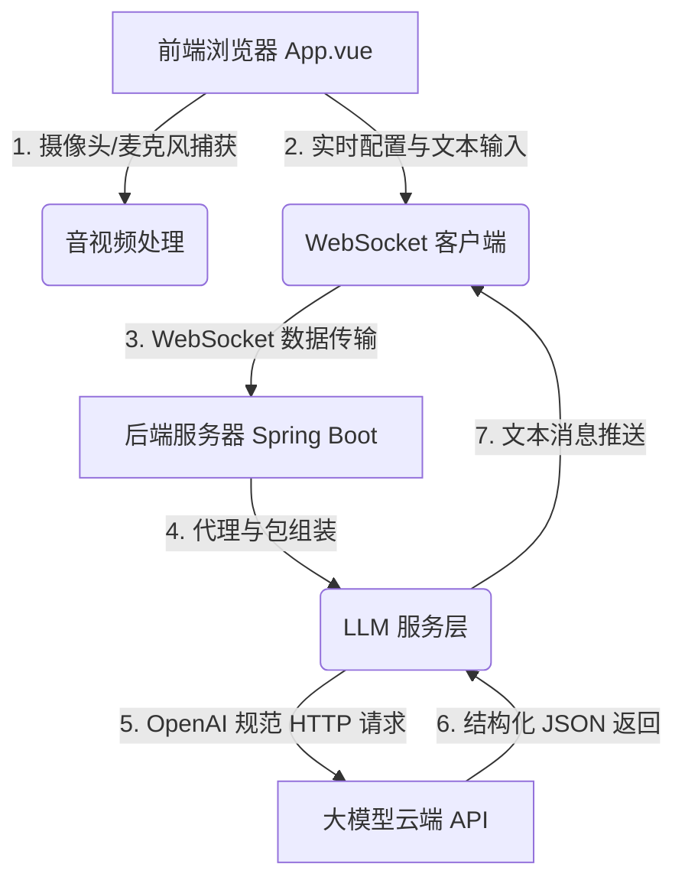

# 🌌 AURA VISION - 智能视觉对话助手 (MVP)

> **2026 七牛云 AI 大模型应用开发挑战赛作品**
> 
> AURA VISION 是一款具有未来感科技风的实时音视频对话助手。它能够通过摄像头捕获你的动作与身处环境的画面，配合 Web Speech 语音输入实现流畅的人机协同对话。

---

## 🎬 演示视频 (Demo Video)

🎥 **[在线观看项目演示 Demo 视频](https://YOUR_ONLINE_VIDEO_URL)** *(建议在浏览器中直接点击在线播放，无需下载或注册)*

---

## ✨ 核心亮点与功能

- 👁️ **实时视觉交互**：自动捕获摄像头视频帧，利用多模态视觉模型（如 `qwen-vl-max`）实时分析用户的动作、面部表情或身处的物理场景。
- 🎙️ **智能语音感知**：基于 Web Speech API 进行高准确度中文语音识别，用户无需打字，直接通过语音与 AI 助手无缝对话。
- 💎 **沉浸式 UI 设计**：采用高级暗黑科技风 (Cyberpunk HUD) 与毛玻璃拟物化 (Glassmorphism) 视觉规范。AI 核心采用 3D 全息呼吸球，在“倾听”、“思考”、“表达”、“待机”状态间顺滑过渡。
- 🛡️ **安全至上**：所有 API 密钥均由用户在本地或网页运行端实时配置，代码库中无任何硬编码密钥，确保代码公开后的安全性。
- ⚙️ **广泛兼容与代理支持**：
  - 支持**阿里百炼（DashScope）**、**OpenAI 官方**等兼容 OpenAI 标准格式的大模型接口。
  - 支持配置正向代理（VPN / Proxy），便于国内网络直连 Google Gemini 等服务。

---

## 🏗️ 技术架构

项目采用**前后端分离**架构，通过 WebSocket 保持低延迟通信：



- **前端 (Frontend)**：Vue 3 + Vite + Javascript (Web Speech API, WebRTC MediaStreams)
- **后端 (Backend)**：Spring Boot 3.x + Spring WebSocket (Java 17/21)

---

## 🚀 快速启动指南

### 1. 后端启动 (Spring Boot)

确保安装了 JDK 17 或以上版本以及 Maven。

```bash
# 进入后端目录
cd backend

# 如果在国内需要使用代理请求海外 API，请修改 backend/src/main/resources/application.properties
# proxy.enabled=true
# proxy.host=127.0.0.1
# proxy.port=7897

# 运行启动
mvn spring-boot:run
```

后端将在 `http://localhost:8080` 启动，并暴露 `/ws/chat` WebSocket 服务。

### 2. 前端启动 (Vue 3)

确保本地安装了 Node.js 18+。

```bash
# 进入前端目录
cd frontend

# 安装依赖
npm install

# 启动本地开发服务
npm run dev
```

前端将在 `http://localhost:5173/` 启动。

---

## ⚙️ 模型配置与使用步骤

1. 打开浏览器访问：**[http://localhost:5173/](http://localhost:5173/)**。
2. 页面默认展示 **配置大模型 API** 浮窗：
   - **快速配置预设**：下拉菜单中选择 **阿里百炼 / 通义千问 (DashScope)**。
   - **API Key**：填入你在阿里云百炼控制台申请的 API 密钥（以 `sk-` 开头）。
   - **Base URL** 与 **模型名称** 预设会自动填入相应的服务地址与 `qwen-vl-max` 视觉模型。
3. 点击 **确定并验证**，验证通过后会提示“配置成功！”。
4. 点击底部的 **开始对话** 按钮，浏览器会请求开启你的摄像头 and 麦克风。
5. 开启后，你就可以开始用语音跟 AURA 助手对话，或者在右侧对话框底部的输入框中打字沟通，AI 会通过摄像头画面来协同回答你的问题。

---

## ⚠️ 安全说明

- **请勿直接在 README 或任何源码文件中上传您的真实 API 密钥/账号密码**。
- 本项目已完全剔除所有硬编码密钥，作品公开后（6月15日 00:00 起必须设为公开）可以放心交由评审进行跑通和代码审查。
- 用户配置 of API Key 仅保存在其浏览器临时会话中，绝不上传或存储到后端数据库，确保个人财产安全。
